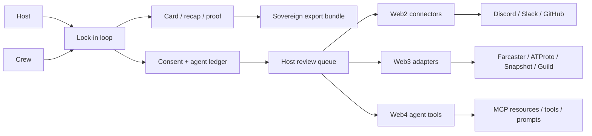

# Sovereign Intelligence System Roadmap

Status: execution roadmap for Starlight Communities inside Vibeclubs.

## Direct Verdict

Build Starlight Communities as a sovereign intelligence system, not as a
destination community platform.

The system should let any host run a focused block, prove what happened, summon
bounded agents, review risky actions, and move the resulting data into Web2,
Web3, or Web4 adapters.

## Architecture

## Product Pillars

1. Ritual: the repeatable lock-in loop.
2. Proof: portable cards, recaps, and contribution history.
3. Consent: explicit, structured, exportable permissions.
4. Agents: Scout, Steward, Witness, Guardian, Builder, Growth, Queen.
5. Connectors: Web2 first, Web3 optional, Web4 guarded.
6. Operations: host cockpit, review queue, reports, analytics, exports.

## Plugin And Connector Roadmap

### P0: Make The Existing Loop Unignorable

- Keep `/lock-in`, the extension, `/host`, and `/host/review` excellent.
- Apply Supabase migrations to a real project.
- Run live RLS tests with two real users.
- Make proof cards the first shareable artifact.
- Add replayable fixtures for exports, cards, agent runs, and approval.

### P1: Web2 Connectors

- Discord Activity: start a lock-in where the crew already talks.
- GitHub proof: attach cards to discussions, issues, or release notes after
  review.
- Slack workflow: slash command or workflow step for work crews.

Why first: Web2 is where adoption happens. It proves behavior before protocol
complexity.

### P2: Web3 Adapters

- Farcaster Mini App: feed-native proof cards and approved launch actions.
- Guild/Collab.Land: optional read-only access verification.
- Snapshot: summarize and archive governance decisions.
- AT Protocol: public proof records after the export model stabilizes.

Why second: Web3 adds ownership and portability only after proof has social pull.

### P3: Web4 Agent Runtime

- MCP server exposing approved Starlight resources:
  - host cockpit state,
  - proof cards,
  - export bundles,
  - agent runs,
  - review queue.
- MCP tools with dangerous actions disabled by default.
- Agent identities with scoped credentials and revocation.
- Queue-backed worker with retries, idempotency, and evals.

Why third: autonomous agents are powerful only when the trust surface is already
legible.

## Experience Types To Support

| Experience | Core loop | Required proof | Best first connector |
| --- | --- | --- | --- |
| Builder sprint | lock in, ship code, recap | GitHub-linked card | GitHub |
| Creator cohort | create, share, invite | social draft + card | Discord |
| Founder operator circle | weekly progress | cockpit metrics | Slack |
| Web3 holder crew | gated work block | role attestation | Guild/Collab.Land |
| DAO workstream | proposal to shipped task | decision log | Snapshot |
| Agent-native ops | queue, review, export | agent ledger | MCP |

## Engineering Priorities

1. Keep the standard package executable.
2. Add connector readiness tests before adapter code.
3. Add real Supabase integration tests before public sovereignty claims.
4. Add queue-backed workers before expanding agent autonomy.
5. Add per-lane permissions before connecting external sends.
6. Add browser smoke checks to every preview for `/host`, `/host/review`, and
   `/lock-in`.
7. Promote production only after preview smoke and Vercel logs are clean.

## Red-Team Line

This becomes excellent if it owns the loop: host starts quickly, crew locks in,
proof ships, agents help safely, and the host can move the data. It becomes weak
if it turns into a broad protocol platform before that loop is loved.
